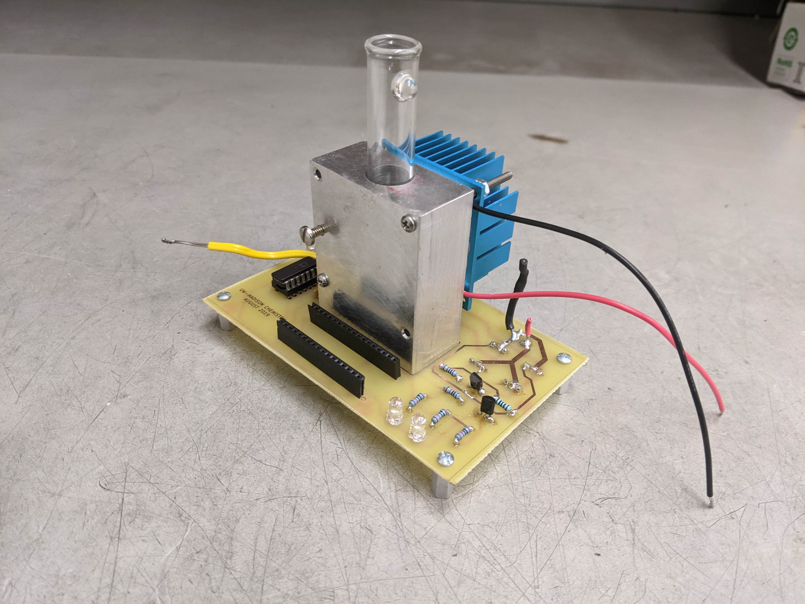

# Thermoelectric Tube

A small project for students to put together as a learning exercise.
Involves machining, glass blowing, and electronics work.

## Repository

This is an open source hardware project licensed under the CERN Open Hardware License Version 2 - Permissive.
Please see the LICENSE file for the complete license.

This repository is being mirrored to several version control systems in an attempt to ensure maximum availability.

| name             | url                                                                          |
| ---------------- | ---------------------------------------------------------------------------- |
| blaise           | https://git.blaise.zone/uw-madison-chem-shops/thermoelectric-tube.git/about/ | 
| Codeburg         | https://codeberg.org/uw-madison-chem-shops/thermoelectric-tube               |
| GitHub (primary) | https://github.com/uw-madison-chem-shops/thermoelectric-tube                 |
| GitLab           | https://gitlab.com/uw-madison-chem-shops/thermoelectric-tube                 |

